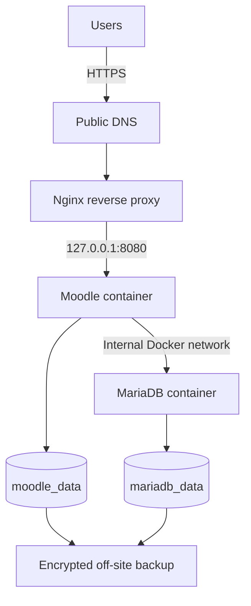

# MundoActivate Platform

[](https://github.com/ingmarbol/mundoactivate-platform/actions/workflows/validate.yml)

Production-inspired, sanitized reference implementation of the **ACTIVATE ONLINE** educational platform.

This repository documents how the platform was designed around Moodle, MariaDB, Docker Compose, Nginx, DNS, TLS, persistent storage, health checks, and operational recovery. It contains **no production credentials, private IP addresses, database backups, student data, SSH keys, or server exports**.

> This is a reconstructed public edition of the architecture. It is intended for technical documentation, learning, reproducibility, and portfolio review—not as a byte-for-byte copy of the production server.

## Architecture



MariaDB is not exposed to the public network. Nginx terminates TLS and forwards requests to Moodle through a loopback-only host binding.

## Technology stack

| Layer | Technology |
|---|---|
| Cloud compute | Hetzner Cloud VPS |
| Operating system | Ubuntu Server 24.04 LTS |
| Application | Moodle 5.0 |
| Database | MariaDB 11.4 |
| Containers | Docker Engine + Docker Compose |
| Edge | Nginx reverse proxy + TLS |
| Persistence | Named Docker volumes |
| Operations | Health checks, restart policies, backup/restore scripts |

## Repository structure

```text
.
├── .github/
│   ├── dependabot.yml
│   └── workflows/validate.yml
├── docs/
│   ├── architecture.md
│   ├── deployment.md
│   ├── operations.md
│   ├── security.md
│   └── troubleshooting.md
├── nginx/moodle.conf.example
├── scripts/
│   ├── backup.sh
│   ├── health-check.sh
│   └── restore.sh
├── .env.example
├── .gitignore
├── compose.yaml
└── Dockerfile
```

## Quick start

Requirements: Linux, Docker Engine, Docker Compose plugin, `curl`, and at least 4 GB RAM for a learning environment.

```bash
cp .env.example .env
```

Replace every value marked `replace-with-...` in `.env`, then run:

```bash
docker compose config
docker compose build --pull
docker compose up -d
docker compose ps
```

For a local-only check:

```bash
curl -I http://127.0.0.1:8080
```

Read the complete [deployment guide](docs/deployment.md) before using the stack.

## Security boundaries

- `.env` is ignored and must never be committed.
- Moodle binds only to `127.0.0.1:8080` on the host.
- MariaDB has no published port.
- TLS is terminated by the host Nginx service.
- Backups must be encrypted and stored outside the VPS.
- Public examples use placeholders instead of production values.

See [security.md](docs/security.md) for the full publication and hardening checklist.

## Operations

```bash
docker compose ps
docker compose logs -f --tail=200 moodle
docker compose logs -f --tail=200 mariadb
./scripts/health-check.sh
```

Backup and restore procedures are documented in [operations.md](docs/operations.md). Always test restores in an isolated environment.

## Live case study

- [Technical case study](https://marco-bolanos-ayora-sistemas-ecuador.netlify.app/proyecto-activate-online.html)
- [ACTIVATE ONLINE platform](https://aula.mundoactivate.com)

## Español

Este repositorio presenta una versión pública y saneada de la arquitectura utilizada para ACTIVATE ONLINE. Documenta la separación entre Moodle, MariaDB, Nginx y almacenamiento persistente, junto con procedimientos de despliegue, seguridad, respaldo, recuperación y diagnóstico.

No contiene información de producción ni debe utilizarse para almacenar secretos. Los valores reales se administran fuera del control de versiones.

## Author

**Mgs. Marco Bolaños Ayora**<br>
Cloud & DevOps Engineer · Infrastructure · Reliability<br>
[Portfolio](https://marco-bolanos-ayora-sistemas-ecuador.netlify.app/) · [LinkedIn](https://www.linkedin.com/in/marco-bolanos-ayora/) · [GitHub](https://github.com/ingmarbol)
