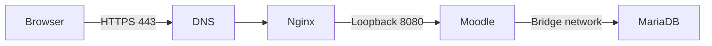
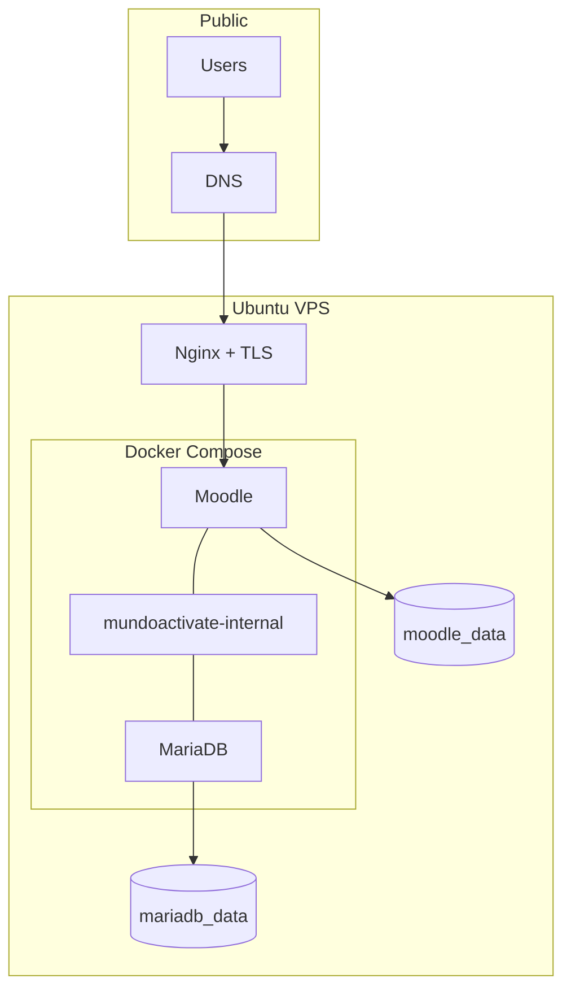

# Architecture

## Request flow

## Trust boundaries

## Design decisions

1. **Loopback-only Moodle binding:** the application is published on `127.0.0.1`, so only the host proxy can reach it.
2. **No database host port:** MariaDB is reachable only by containers attached to the private bridge network.
3. **Health-aware startup:** Moodle waits until MariaDB reports a healthy state.
4. **Persistent data:** application files and database state are stored in named volumes.
5. **Host-level edge:** Nginx terminates TLS and centralizes public web controls.
6. **Recoverability:** database and application data are backed up together and must be tested through isolated restores.
